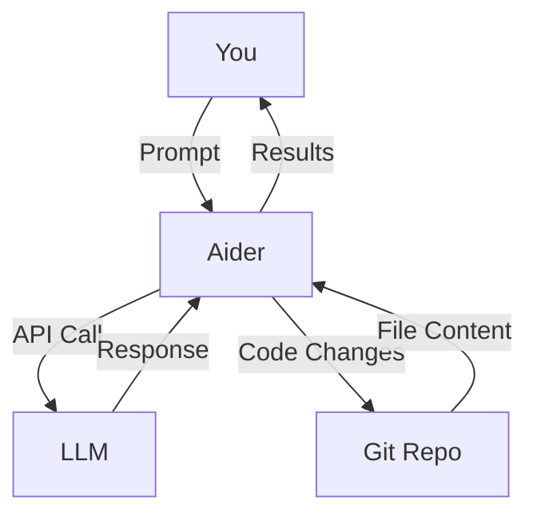

# Aider
# 🚀 _Coding on Jetfuel_ 🚀

<div class="abs-br m-6 flex gap-2">
  <a href="https://aider.chat" target="_blank" class="text-xl icon-btn opacity-50 !border-none !hover:text-white">
    <carbon:document-unknown />
  </a>
  <a href="https://github.com/paul-gauthier/aider" target="_blank" class="text-xl icon-btn opacity-50 !border-none !hover:text-white">
    <carbon:logo-github />
  </a>
</div>

<style>
h1 {
  color: white;
}
</style>

---

# Hold up, this isn't a PPT?
Quick detour...

Its not! This is slidev, give it a shot. Amongst other things, it allows you to use AI more meaningfully to help craft presentations. No need for copilots!

## References
- [Slidev Documentation](https://sli.dev/)
- [Slidev GitHub Repository](https://github.com/slidevjs/slidev)
- [Slidev Discord Community](https://discord.gg/slidev)
(💯 hallucinated link)
<!-- Speaker Notes
Actual link for discord: https://chat.sli.dev/
-->

---

# What is Aider? 
/ɛ.de/ french for "Helping" - Its absolutely awesome! 🎉

<div class="grid grid-cols-2 gap-4">
<div>

- AI semi-autonomous programming tool that uses LLMs to understand and update your code
- Supports most LLMs & backends (e.g.: bedrock)
- Structures prompts and code for you to the LLM
- Integrated with git
  - Shares repo map with llm for context
  - Summarizes changes makes a git commit
- Gathers code changes in `diff` format
- Scrapes URLs you give it, as needed
- Voice mode! 🎤

Clone it from github [here](https://github.com/paul-gauthier/aider) or https://aider.chat/
</div>
<div>



</div>
</div>

<!--
Speaker Notes
Explain why this is different from Github Copilot or other tools. End state is, no IDE.
-->

---

# Initial Setup
Installing and getting your Aider ready to go.


```zsh
python -m pip install aider-chat
```
```ini
# cat ~/.zshrc
OPENAI_API_KEY=<your-key>
ANTHROPIC_API_KEY=<your-key>
```
```zsh
# cat ~/.aider.conventions.md
- Adhere to PEP8 guidelines
- There is no tabs, only spaces
```
```zsh
# cat ~/.aider.conf.yml
read: [~/.aider.conventions.md]
model: o1-preview
editor-model: claude-3-5-sonnet-20241022
edit-format: architect
git: true
auto-commits: true
```

💡 Pro tip: You can also have a different `.aider.conf.yml` in your project, or use command line toggles.

---

# Coding Modes

- **Architect mode**: Two-step process for better results
  - First, LLM proposes a solution and explains the changes
  - You review and approve the plan
  - Then a second LLM implements the approved changes
  - Great with models like o1-preview that are strong at planning
  - More reliable for complex changes
- **Code mode**: Direct, fast editing of your files
  - LLM directly proposes code changes
  - Quick for simple changes and when you know exactly what you want
  - Best with models that are good at editing code like GPT-4 or Claude

Refer to the Aider leaderboard to see which models perform best right now.
https://aider.chat/docs/leaderboards/

---

# Approach to using Aider
Tips & tricks for smooth experience

**Getting started**
- Set up building blocks iteratively to avoid overloading / confusing the model
- If you're not clear on the direction, /ask first
- Test your functions as you go, have it fix issues (/run or /test)
- Add functionality
- Refactor

**Pro-ish tips**
- Add only relevant files to chat.
- Clear chat history when switching tasks.
- Hop back and forth, use aider for a bit, swap to IDE for a few, swap back.
- Try adding TODOs in your code for aider to resolve. Easier to illustrate where to fix.
- Tweak your conventions.
<!-- 
**Interesting use cases**
- Write a class to utilise this API, provide the openapi spec json
- Do some data parsing on CSVs
- Write up
-->

---

# Essential Commands

- `/add <file>` - Add files to edit (must be git)
- `/ask` - Ask questions without editing
- `/undo` - Woopsie... Revert last commit
- `/chat-mode` - Use to swap to code mode only if you are in architect mode
- `/run <cmd>` - Execute shell command, you can then feed output back into conversation
- `/multiline-mode` - Toggle multiline mode when you really have alot to say
- `/help` - Get command help, interactive help uses the LLM and help files to answer questions
- `/voice` - Lay back, kick your feet up. Record and transcribe voice input

---
class: text-center
layout: center
---

# Demo

---

# Additional Resources

- Questions (limited time opportunity!)
- Documentation: https://aider.chat/docs/
- GitHub: https://github.com/Aider-AI/aider
- Discord: https://discord.gg/Tv2uQnR88V
